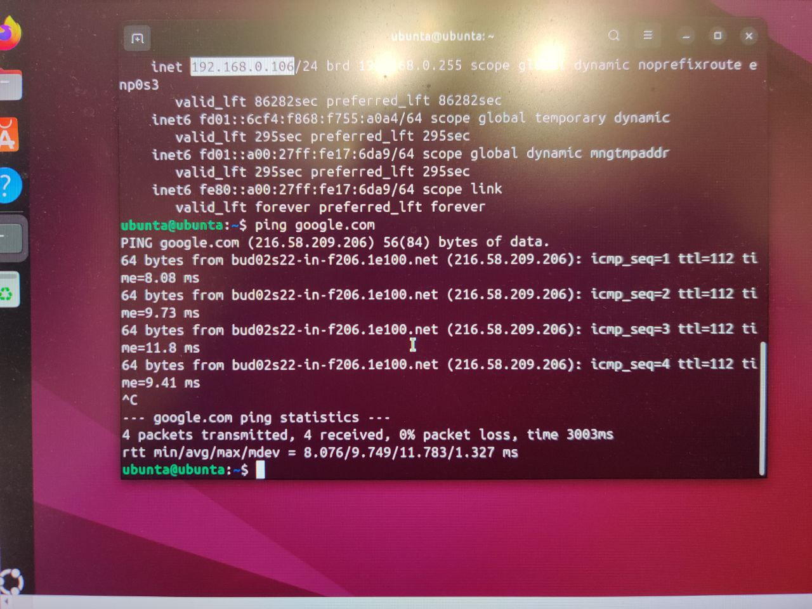

#Отчет по лабораторной работе 3 by Stepanov Kirill  
В этой лабораторной работе нам нужно было скачать virtualbox и через него установить виртуальные машины.  
Я установил первую машину, назвав ее 'ubunta', и с помощью команды ip a узнал ее ip адресс, потом в настройках виртуал бокса  
я поставил ей доступ к интернету, а с помощью команды ping google.com я проверил ее подключение.  
Результаты положительные и отражены на картинке:  
  
  
  
Далее я создал вторую виртуальную машину 'machineb' также подключил ее к интернету, нашел ее ip, и потом с помощью команды ping <(ip address machine b)>
проверил подключается ли 1-я в.м. ко 2-ой:  
  
Аналогично сделал для третей машины
  
Потом установил firewall для машины C, чтобы нельзя было подключиться к ней с машины B командой: 
sudo firewall-cmd --permanent --add-rich-rule='rule family="ipv4" source address="192.168.0.167" reject'
  
В конце просили показать 3 запущенные машины одновременно:  
  
